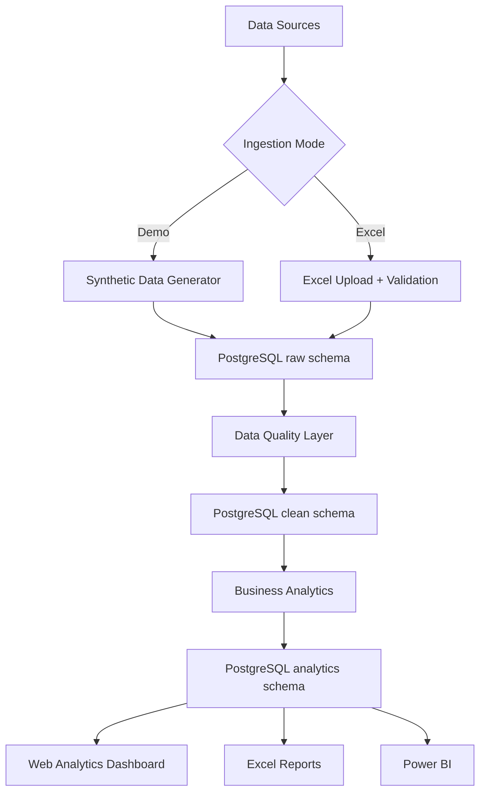
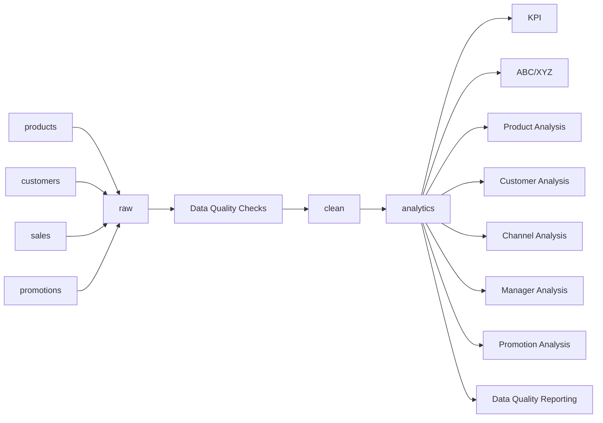
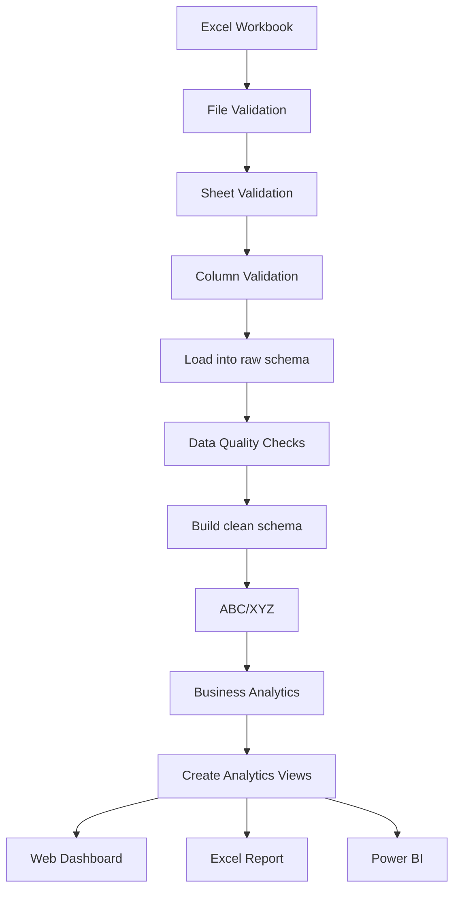
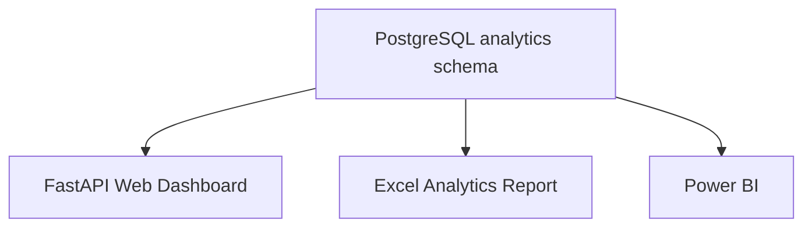
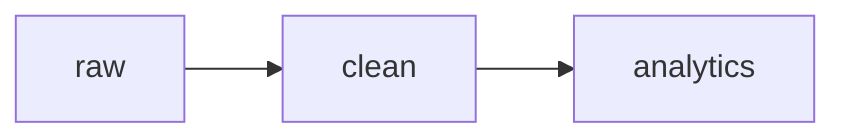

# Sales & Data Quality Analytics System

An end-to-end **Sales Analytics + Data Quality** portfolio project built with **Python, Pandas, PostgreSQL, SQL, FastAPI, Docker, Excel, Chart.js, and Power BI**.

The project demonstrates how business data can move from ingestion to validation, cleaning, modeling, analytics, reporting, and BI while preserving a clear separation between **raw**, **clean**, and **analytics** data layers.

---

## Overview

The system supports two ingestion modes:

- **Synthetic demo data generation**
- **Excel workbook upload**

Both flows converge into the same PostgreSQL analytics architecture.

```text
Source Data
   ↓
Data Ingestion
   ↓
Data Quality Validation
   ↓
Cleaning
   ↓
Data Modeling
   ↓
Business Analytics
   ↓
Web Dashboard / Excel Report / Power BI
```

The project is suitable for portfolio presentation for roles such as:

- Data Analyst
- Data Quality Analyst
- Business Analyst
- Operations Analyst
- Sales Analyst

---

## Key Features

- Synthetic business data generation
- Excel workbook upload
- Excel sheet and column validation
- PostgreSQL raw data storage
- Automated Data Quality checks
- Clean data layer generation
- ABC/XYZ product segmentation
- Sales KPI calculation
- Product analytics
- Customer analytics
- Channel analytics
- Manager analytics
- Promotion effectiveness analysis
- Built-in web analytics dashboard
- Data Quality dashboard
- Data Quality issue browser
- Excel template generator
- Sample Excel export
- Full Excel analytics report
- Power BI-ready analytical marts
- Docker-based deployment
- Automated tests

---

## Technology Stack

| Area | Technologies |
|---|---|
| Backend | Python 3.12, FastAPI |
| Data Processing | Pandas, NumPy |
| Database | PostgreSQL 16, SQL |
| DB Access | SQLAlchemy, psycopg2 |
| Excel | openpyxl |
| Web Visualization | Chart.js, Jinja2 |
| BI | Power BI |
| Infrastructure | Docker, Docker Compose |
| DB Administration | pgAdmin |
| Testing | pytest |

---

# Architecture

## 1. High-Level System Architecture



---

## 2. Data Layer Architecture



### `raw`

Preserves source data before business cleaning.

```text
raw.products
raw.customers
raw.sales
raw.promotions
```

### `clean`

Contains validated and trusted data.

```text
clean.products
clean.customers
clean.sales
clean.promotions
```

### `analytics`

Contains business-ready metrics, marts, and views.

```text
analytics.data_quality_issues
analytics.data_quality_summary
analytics.data_quality_score

analytics.product_abc_xyz
analytics.fact_sales_enriched
analytics.kpi_summary

analytics.monthly_sales
analytics.product_sales
analytics.customer_sales
analytics.channel_sales
analytics.manager_sales
analytics.promo_analysis

analytics.v_sales_by_category
analytics.v_sales_by_brand
analytics.v_monthly_sales
```

---

## 3. Excel Upload Architecture



Required Excel sheets:

```text
products
customers
sales
promotions
```

Supported file format:

```text
.xlsx
```

---

## 4. Reporting Architecture



The analytics layer is intentionally independent from the visualization tool.

This means the same business logic can be reused by:

- Web Dashboard
- Excel Reports
- Power BI
- Other BI/reporting tools

---

# Project Structure

```text
sales_data_quality/
│
├── .env.example
├── .gitignore
├── docker-compose.yml
├── Makefile
├── README.md
│
└── app/
    ├── Dockerfile
    ├── requirements.txt
    │
    ├── data/
    │   ├── raw/
    │   ├── cleaned/
    │   ├── output/
    │   └── uploads/
    │
    ├── sql/
    │   ├── 01_create_raw.sql
    │   └── 02_views.sql
    │
    ├── tests/
    │   └── test_logic.py
    │
    └── src/
        ├── db.py
        ├── generate_data.py
        ├── load_raw.py
        ├── quality_report.py
        ├── clean_data.py
        ├── abc_xyz.py
        ├── business_analysis.py
        ├── create_views.py
        ├── run_pipeline.py
        ├── run_uploaded_pipeline.py
        ├── excel_import.py
        │
        └── web/
            ├── __init__.py
            ├── main.py
            │
            └── templates/
                ├── base.html
                ├── index.html
                ├── result.html
                ├── dashboard.html
                ├── products.html
                ├── customers.html
                ├── promotions.html
                ├── data_quality.html
                └── issues.html
```

---

# Data Quality Framework

The project validates four major Data Quality dimensions.

## Completeness

Checks whether required values are present.

Examples:

- Missing barcode
- Missing category
- Missing required values

```sql
SELECT *
FROM raw.products
WHERE barcode IS NULL;
```

## Uniqueness

Checks whether values that should be unique are duplicated.

Examples:

- Duplicate barcode
- Duplicate sales records

```sql
SELECT
    barcode,
    COUNT(*) AS cnt
FROM raw.products
WHERE barcode IS NOT NULL
GROUP BY barcode
HAVING COUNT(*) > 1;
```

## Validity

Checks whether values satisfy business rules.

Examples:

- Negative quantity
- Invalid product price
- Invalid unit price

## Referential Integrity

Checks whether referenced entities exist.

```sql
SELECT s.*
FROM raw.sales s
LEFT JOIN raw.products p
    ON s.product_id = p.product_id
WHERE p.product_id IS NULL;
```

---

# Demo Dataset

The default synthetic dataset contains approximately:

```text
Products:        500
Customers:       500
Sales:        30,003
Promotions:       40
```

Intentional Data Quality issues are inserted to test the validation pipeline.

Examples:

- Missing barcodes
- Duplicate barcodes
- Missing categories
- Invalid prices
- Negative quantity
- Invalid unit price
- Unknown product IDs
- Unknown customer IDs
- Duplicate sales rows

Typical result:

```text
Data Quality Issues: 105
Data Quality Score:   99.66%

Clean Products:       481
Clean Customers:      500
Clean Sales:        28,858
Clean Promotions:      39
```

> The Data Quality Score is a simplified portfolio metric and is not intended to represent a universal production Data Quality methodology.

---

# Web Application

Open:

```text
http://localhost:8002
```

Available actions:

```text
Open Analytics Dashboard
Download Excel Template
Download Sample Excel
Upload & Run Analysis
```

---

# Web Analytics Dashboard

## Executive Overview

```text
http://localhost:8002/dashboard
```

Includes:

- Total Revenue
- Orders
- Average Order Value
- Gross Profit
- Gross Margin %
- Monthly Revenue
- Revenue by Channel
- Revenue by Manager
- Revenue by Category
- Top Products

## Product Analysis

```text
http://localhost:8002/products
```

Includes:

- Revenue by Category
- Revenue by Brand
- ABC Distribution
- XYZ Distribution
- ABC/XYZ Matrix
- Top Products

## Customer Analysis

```text
http://localhost:8002/customers
```

Includes:

- Revenue by City
- Revenue by Customer Type
- Top Customers
- Orders by Customer

## Promotion Analysis

```text
http://localhost:8002/promotions
```

Includes:

- Revenue Before Promotion
- Revenue During Promotion
- Revenue Uplift %
- Quantity Uplift %
- Campaign Performance

## Data Quality Dashboard

```text
http://localhost:8002/data-quality
```

Includes:

- Data Quality Score
- Total Issues
- Checked Rows
- Issues by Type
- Issues by Table
- Data Quality Checks

## Data Quality Issue Details

```text
http://localhost:8002/issues
```

Displays:

```text
Check
Table
Issue Type
Row Key
Detail
```

---

# Excel Reporting

## Excel Template

Generated file:

```text
sales_data_template.xlsx
```

Contains the required workbook structure.

## Sample Dataset

Generated file:

```text
sales_data_sample.xlsx
```

Exports the current PostgreSQL raw layer.

## Full Analytics Report

Generated file:

```text
data_quality_report.xlsx
```

Contains:

```text
Summary
Issue Summary
Issues

Clean Products
Clean Customers
Clean Sales
Clean Promotions

ABC_XYZ

KPI Summary
Product Sales
Customer Sales
Channel Sales
Manager Sales
Monthly Sales

Promo Analysis
```

Exported worksheets include:

- Frozen headers
- Automatic filters
- Adjusted column widths

---

# ABC Analysis

ABC analysis measures product economic importance using cumulative revenue.

Default thresholds:

```text
A = first 80% of cumulative revenue
B = next 15%
C = remaining 5%
```

Configuration:

```env
ABC_A_THRESHOLD=0.80
ABC_B_THRESHOLD=0.95
```

---

# XYZ Analysis

XYZ analysis measures demand stability using the coefficient of variation.

```text
CV = Standard Deviation / Mean
```

Default thresholds:

```text
X <= 0.10
Y <= 0.25
Z > 0.25
```

Configuration:

```env
XYZ_X_THRESHOLD=0.10
XYZ_Y_THRESHOLD=0.25
```

---

# ABC/XYZ Business Interpretation

| Segment | Meaning | Typical Business Action |
|---|---|---|
| AX | High importance, stable demand | Maintain high availability |
| AY | High importance, medium variability | Monitor stock carefully |
| AZ | High importance, unstable demand | Strong forecasting control |
| BX | Medium importance, stable demand | Standard replenishment |
| BY | Medium importance, medium variability | Balanced stock policy |
| BZ | Medium importance, unstable demand | Conservative inventory |
| CX | Low importance, stable demand | Low-priority replenishment |
| CY | Low importance, medium variability | Review assortment |
| CZ | Low importance, unstable demand | Consider stock reduction |

---

# Business KPIs

The project calculates:

```text
Revenue
Orders
Customers
Products Sold
Average Order Value
Gross Profit
Gross Margin %
```

## Revenue

```text
Revenue = Quantity × Unit Price
```

## Gross Profit

```text
Gross Profit = Revenue - Gross Cost
```

## Gross Margin

```text
Margin % = Gross Profit / Revenue × 100
```

## Average Order Value

```text
Average Order Value = Revenue / Number of Orders
```

Distinct `order_id` values are used for order count.

---

# Promotion Analysis

Promotion performance is compared with an equal-duration baseline period before the campaign.

Metrics include:

```text
Revenue Before
Revenue During
Quantity Before
Quantity During
Revenue Uplift %
Quantity Uplift %
```

Formula:

```text
Revenue Uplift % =
(Revenue During - Revenue Before)
/
Revenue Before
× 100
```

For production-grade analysis, additional factors should also be considered:

- Gross Profit
- Margin
- Seasonality
- Customer Segmentation
- Control Groups
- Repeat Purchases

---

# Power BI

Power BI remains fully supported.

The analytics logic is kept outside the BI tool so Power BI consumes the same PostgreSQL `analytics` layer as the web dashboard.

Connection from Windows:

```text
Host: localhost
Port: 55432
Database: sales_quality
User: postgres
Password: postgres
```

Recommended tables:

```text
analytics.kpi_summary
analytics.monthly_sales
analytics.product_sales
analytics.customer_sales
analytics.channel_sales
analytics.manager_sales
analytics.product_abc_xyz
analytics.promo_analysis
analytics.data_quality_score
analytics.data_quality_summary
analytics.data_quality_issues
```

Recommended Power BI pages:

- Executive Overview
- Product Analysis
- Customer Analysis
- Promotion Analysis
- Data Quality

---

# Running the Project

## 1. Clone

```bash
git clone https://github.com/khachatryan1988/sales_data_quality.git
cd sales_data_quality
```

## 2. Create `.env`

Copy:

```text
.env.example
```

to:

```text
.env
```

Example:

```env
COMPOSE_PROJECT_NAME=sales_data_quality

POSTGRES_DB=sales_quality
POSTGRES_USER=postgres
POSTGRES_PASSWORD=postgres

POSTGRES_HOST_PORT=55432
POSTGRES_CONTAINER_PORT=5432

DB_HOST=db

PGADMIN_EMAIL=admin@example.com
PGADMIN_PASSWORD=admin
PGADMIN_HOST_PORT=5050

PRODUCT_COUNT=500
CUSTOMER_COUNT=500
SALES_COUNT=30000
PROMOTION_COUNT=40
RANDOM_SEED=42

ABC_A_THRESHOLD=0.80
ABC_B_THRESHOLD=0.95

XYZ_X_THRESHOLD=0.10
XYZ_Y_THRESHOLD=0.25
```

## 3. Start services

```bash
docker compose up -d db pgadmin web
```

Check:

```bash
docker compose ps
```

---

# Service URLs

| Service | URL |
|---|---|
| Web App | `http://localhost:8002` |
| Analytics Dashboard | `http://localhost:8002/dashboard` |
| pgAdmin | `http://localhost:5050` |

---

# PostgreSQL Connections

## From pgAdmin inside Docker

```text
Host: db
Port: 5432
Database: sales_quality
User: postgres
Password: postgres
```

## From Windows / DBeaver / Power BI

```text
Host: localhost
Port: 55432
Database: sales_quality
User: postgres
Password: postgres
```

---

# Demo Pipeline

Run:

```bash
docker compose run --rm analytics
```

Execution order:

```text
generate_data.py
↓
load_raw.py
↓
quality_report.py
↓
clean_data.py
↓
abc_xyz.py
↓
business_analysis.py
↓
create_views.py
```

---

# Excel Upload Pipeline

Excel upload intentionally skips synthetic generation.

```text
Excel Workbook
↓
excel_import.py
↓
raw schema
↓
quality_report.py
↓
clean_data.py
↓
abc_xyz.py
↓
business_analysis.py
↓
create_views.py
```

---

# Tests

Run:

```bash
docker compose run --rm analytics pytest -q
```

Current tests include:

- Revenue calculation
- Margin calculation
- Duplicate detection

---

# Example SQL

## Total Revenue

```sql
SELECT
    SUM(revenue)
FROM clean.sales;
```

## Orders

```sql
SELECT
    COUNT(DISTINCT order_id)
FROM clean.sales;
```

## Top Products

```sql
SELECT *
FROM analytics.product_sales
ORDER BY revenue DESC
LIMIT 10;
```

## Revenue by Channel

```sql
SELECT *
FROM analytics.channel_sales
ORDER BY revenue DESC;
```

## Revenue by Manager

```sql
SELECT *
FROM analytics.manager_sales
ORDER BY revenue DESC;
```

## ABC/XYZ Distribution

```sql
SELECT
    abc_xyz_class,
    COUNT(*) AS products
FROM analytics.product_abc_xyz
GROUP BY abc_xyz_class
ORDER BY abc_xyz_class;
```

## Data Quality Issues

```sql
SELECT *
FROM analytics.data_quality_issues
ORDER BY table_name, check_name;
```

---

# Why `raw → clean → analytics`



### `raw`

Preserves original source data and Data Quality problems.

### `clean`

Contains validated and trusted records.

### `analytics`

Contains business-ready metrics, marts, and views.

Benefits:

- Traceability
- Maintainability
- Data Quality control
- Reproducibility
- Reporting performance
- BI independence

---

# Portfolio Skills Demonstrated

This project demonstrates practical experience with:

- Python
- Pandas
- SQL
- PostgreSQL
- Data Quality
- Data Cleaning
- Relational Data
- Business Analytics
- ABC/XYZ
- Promotion Analysis
- Sales KPIs
- Excel Ingestion
- Excel Reporting
- FastAPI
- Jinja2
- Chart.js
- Docker
- Power BI
- Git / GitHub

---

# Interview Summary

> I built an end-to-end Sales & Data Quality Analytics System using Python, Pandas, PostgreSQL, SQL, Docker, FastAPI, Excel, Chart.js, and Power BI. The system supports both synthetic data generation and Excel uploads. Data moves through raw, clean, and analytics layers. I implemented automated Data Quality checks, ABC/XYZ product segmentation, sales and promotion analytics, web dashboards, Excel reporting, and Power BI-ready analytical marts.

---

# Author

**Khachatur Khachatryan**

GitHub:

```text
https://github.com/khachatryan1988
```

Repository:

```text
https://github.com/khachatryan1988/sales_data_quality
```
